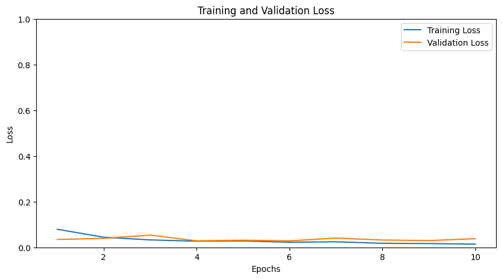
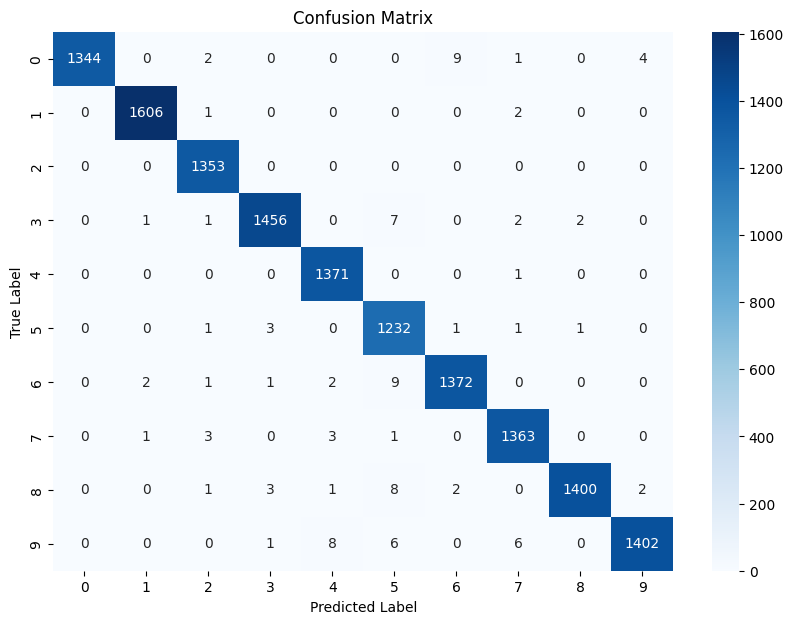

# DenseNet-Implementation

This repo trains a DenseNet-121 model on the MNIST dataset. The dataset is resized and normalized to fit the DenseNet model, and training is done using PyTorch.

#### DenseNet Architecture


## Project Steps

### 1. Import Required Libraries
To set up the environment, use the following commands:

```bash
conda create --name pytorch_env python=3.11.9 --file requirements.txt
conda activate pytorch_env
```

### 2. Load the MNIST Dataset
- Dataset is loaded using `torchvision.datasets.MNIST`.
- Images are resized to 224x224, normalized, and converted to tensors.

### 3. Split the Dataset
The combined training and test dataset is split into:
- **Training Set**: 42,000 samples
- **Validation Set**: 14,000 samples
- **Test Set**: 14,000 samples

### 4. Load Pre-trained DenseNet
- DenseNet-121 is loaded and modified for single-channel input and 10 output classes.
- Model is moved to GPU if available.

### 5. Define Loss Function and Optimizer
- **Loss Function**: CrossEntropyLoss
- **Optimizer**: Adam with learning rate 0.001

## Results

- **Test Accuracy**: The accuracy achieved on the test set is **99.28%** </br></br>


- **Confusion Matrix**: A heatmap of the confusion matrix displays the model's performance across all classes.</br></br>

## References

- [Densely Connected Convolutional Networks](https://arxiv.org/abs/1608.06993)
- [DenseNet - PyTorch](https://pytorch.org/hub/pytorch_vision_densenet/)